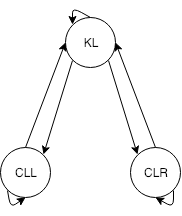

# CarND-Path-Planning-Project
Self-Driving Car Engineer Nanodegree Program

### Simulator.
You can download the Term3 Simulator which contains the Path Planning Project from the [releases tab (https://github.com/udacity/self-driving-car-sim/releases/tag/T3_v1.2).  

To run the simulator on Mac/Linux, first make the binary file executable with the following command:
```shell
sudo chmod u+x {simulator_file_name}
```

### Goals
In this project my goal was to safely navigate around a virtual highway with other traffic that is driving +-10 MPH of the 50 MPH speed limit. I was provided the car's localization and sensor fusion data, there is also a sparse map list of waypoints around the highway. The car should try to go as close as possible to the 50 MPH speed limit, which means passing slower traffic when possible, note that other cars will try to change lanes too. The car should avoid hitting other cars at all cost as well as driving inside of the marked road lanes at all times, unless going from one lane to another. The car should be able to make one complete loop around the 6946m highway. Since the car is trying to go 50 MPH, it should take a little over 5 minutes to complete 1 loop. Also the car should not experience total acceleration over 10 m/s^2 and jerk that is greater than 10 m/s^3.

#### The map of the highway is in data/highway_map.txt
Each waypoint in the list contains  [x,y,s,dx,dy] values. x and y are the waypoint's map coordinate position, the s value is the distance along the road to get to that waypoint in meters, the dx and dy values define the unit normal vector pointing outward of the highway loop.

The highway's waypoints loop around so the frenet s value, distance along the road, goes from 0 to 6945.554.

## Basic Build Instructions

1. Clone this repo.
2. Compile: `./build.sh`.
3. Run it: `./run.sh`.

Here is the data provided from the Simulator to the C++ Program

#### Main car's localization Data (No Noise)

["x"] The car's x position in map coordinates

["y"] The car's y position in map coordinates

["s"] The car's s position in frenet coordinates

["d"] The car's d position in frenet coordinates

["yaw"] The car's yaw angle in the map

["speed"] The car's speed in MPH

#### Previous path data given to the Planner

//Note: Return the previous list but with processed points removed, can be a nice tool to show how far along
the path has processed since last time. 

["previous_path_x"] The previous list of x points previously given to the simulator

["previous_path_y"] The previous list of y points previously given to the simulator

#### Previous path's end s and d values 

["end_path_s"] The previous list's last point's frenet s value

["end_path_d"] The previous list's last point's frenet d value

#### Sensor Fusion Data, a list of all other car's attributes on the same side of the road. (No Noise)

["sensor_fusion"] A 2d vector of cars and then that car's [car's unique ID, car's x position in map coordinates, car's y position in map coordinates, car's x velocity in m/s, car's y velocity in m/s, car's s position in frenet coordinates, car's d position in frenet coordinates. 

## Details

1. The car uses a perfect controller and will visit every (x,y) point it recieves in the list every .02 seconds. The units for the (x,y) points are in meters and the spacing of the points determines the speed of the car. The vector going from a point to the next point in the list dictates the angle of the car. Acceleration both in the tangential and normal directions is measured along with the jerk, the rate of change of total Acceleration. The (x,y) point paths that the planner recieves should not have a total acceleration that goes over 10 m/s^2, also the jerk should not go over 50 m/s^3. (NOTE: As this is BETA, these requirements might change. Also currently jerk is over a .02 second interval, it would probably be better to average total acceleration over 1 second and measure jerk from that.

2. There will be some latency between the simulator running and the path planner returning a path, with optimized code usually its not very long maybe just 1-3 time steps. During this delay the simulator will continue using points that it was last given, because of this its a good idea to store the last points you have used so you can have a smooth transition. previous_path_x, and previous_path_y can be helpful for this transition since they show the last points given to the simulator controller with the processed points already removed. You would either return a path that extends this previous path or make sure to create a new path that has a smooth transition with this last path.

## Tips

A really helpful resource for doing this project and creating smooth trajectories was using http://kluge.in-chemnitz.de/opensource/spline/, the spline function is in a single hearder file is really easy to use.

---

## Dependencies

* cmake >= 3.5
  * All OSes: [click here for installation instructions](https://cmake.org/install/)
* make >= 4.1
  * Linux: make is installed by default on most Linux distros
  * Mac: [install Xcode command line tools to get make](https://developer.apple.com/xcode/features/)
  * Windows: [Click here for installation instructions](http://gnuwin32.sourceforge.net/packages/make.htm)
* gcc/g++ >= 5.4
  * Linux: gcc / g++ is installed by default on most Linux distros
  * Mac: same deal as make - [install Xcode command line tools]((https://developer.apple.com/xcode/features/)
  * Windows: recommend using [MinGW](http://www.mingw.org/)
* [uWebSockets](https://github.com/uWebSockets/uWebSockets)
  * Run either `install-mac.sh` or `install-ubuntu.sh`.
  * If you install from source, checkout to commit `e94b6e1`, i.e.
    ```
    git clone https://github.com/uWebSockets/uWebSockets 
    cd uWebSockets
    git checkout e94b6e1
    ```

# Project Rubric


The goal of the project was to develop software for safe driving a car around a virtual highway.
This writeup describes the approach taken to complete the project.

## Design

The design was choosen with respect to the diagram shown in the classroom.


The project has three main components listed below:
- Prediction
- Behavior Planner
- Trajectory Generator

The Localization, Sensor Fusion and Motion Control components were not implemented as they were already provided as parts of the Term3 simulator.

## Data flow (inputs/outputs)

The developed software runs an infinite loop; at each iteration it takes in the output of the simulator and produces a trajectory for ego-car which is sent back to the simulator.

A highlevel data-flow diagram is shown below:


## Project structure

The `src/` directory of the repository contains the project's source code.
Here you can find descriptions of each file:

| File(s) | Purpose |
|------|---------|
| `main.cpp` | The entrypoint of the project. |
| `utils.h` | Contains helper functions used in different places in the project. |
| `vehicle.h` and `vehicle.cpp` | Describes the vehicle's state such as x, y, s, d coordinates, velocity and yaw. |
| `road.h` and `road.cpp` | Contains a road definition and useful helper methods such as `get_lane_center()`. |
| `spline.h` | Spline interpolation implementation provided in the classroom. |
| `json.hpp` | A module for working with JSONs. |
| `fsm.h` | Defines the Finite State Machine used in the project. |
| `cost.h` | Contains the cost functions used in the behavior module. |
| `prediction.h` and `prediction.cpp` | Implementation of the Prediction module. |
| `behavior.h` and `behavior.cpp` | Implementation of the Behavior module. |
| `traj_gen.h` and `traj_gen.cpp` | Implementation of the Trajectory Generator module. |

## Prediction

For this project I implemented a naive prediction which assumes that all the non-ego cars will move with contant speed along the `s-` axis.

In order to implement the logic I iterate over a list of non-ego vehicles provided by the simulator. For each vehicle I calculate its velocity as a squared root of the sum of its velocities along the `x-` and `y-` axises: `double velocity = sqrt(vx*vx + vy*vy);`. Then I use the velocity to calculate the distance the car will move along the `s-` axis in time `dt` where `dt` is defined by the `pred_resolution_sec` variable. The `d-` coordinatate of the car does not change over time as we assume that the car moves straight along the `s-` axis.

## Behavior Planner

The behavior planner developed for this project is based on a finite state machine. At each iteration the planner generates rough trajectories for each successor states of the current FMS's state. Then it finds the best trajectory - a trajectory with the minimal cost value. The best trajectory then transforms into a target object.

### FSM and its states

The finite state machine has three states:
- Keep Lane (KL)
- Change Lane Left (CLL)
- Change Lane Right (CLR)

The transitions between the states are shown on the picture below.



In the **Keep Lane** state the ego-car goes in the middle of its current lane. The car adapts its speed if there is a vehicle ahead of it.

In the **Change Lane Left(Right)** states the ego-car performs a maneuver in order to change its lane on the left(right). In this state the car is also adapts its speed if there is a vehicle ahead of it.

### Rough trajectories

To generate rough trajectories I implemented a generic function `rough_trajectory()`. The function takes in three parameters: current ego-car's state, predictions and target lane. The function will try to generate a rough trajectory from the current car's position to the target lane as far as it can safely go. The algorithms takes into account non-ego vehicles and tries to generate a safe trajectory.

### Cost functions

In order to compare trajectories I defines four cost functions:
- `collision_cost()` - a binary cost function which returns `1` if the given trajectory lead to at least one collision.
- `maneuver_safety_cost()` - a binary cost function which returns `1` if there're any vehicles on the left(right) side of the ego-car when it starts the left(right) maneuver.
- `inefficiency_cost()` - the cost becomes higher if the ego-car moves slower.
- `change_lane_cost()` - adds penalty for a lane change.

The corresponding weights are defined in `behavior.cpp` and choosen as following:
- `w_collision = 1000;`
- `w_maneuver_safety = 100;`
- `w_inefficiency = 10;`
- `w_change_lane = 1;`

I wanted the algorithm to focus on safety that's why any collision is a subject of the highest penalty. I also wanted the algorithm to not drive the car too slow, that why the innefficiency cost function has the third highest weight.

### Target

The output of the Behavior Planner is the target object. The object has three fields:
- `lane` - target lane. The trajectory generator will need to create a trajectory from current lane to the target lane.
- `speed` - target speed. It says to trajectory generator to generate trajectories so that ego-car's speed is equal to or very close to the target speed. The value might be negative which means it is up to the trajectory generator to choose the speed.
- `vehicle_id` - ID of a vehicle to follow. If it is not negative trajectory generator must create trajectories for following the vehicle with this ID.

## Trajectory Generator

At each iteration the Trajectory Generator ensures there are exactly `points_ahead` points in the trajectory sent to the simulator. Its current value is choosen as `10`. Bigger values can lead to delayed actions while smaller values can leave the simulator without any trajectory in case when path planning took longer than expected.

### Smoothing

The Trajectory Generator uses the spline interpolation to get a smooth trajectory from car's current position to its target position. I use the `get_trajectory_waypoints()` method to generate a skeleton of the desired trajectory which is later used as spline input.

Once a smooth path is found the trajectory generator uses the vehicle's motion model to build the output trajectory.

### Motion Model

Trajectory generator assumes a vehicle could have accelaration in the range of `[-max_accel, max_accel]`.

Then it uses the target object provided by the Behavior Planner to find the target velocity. If the target velocity is not given in the target object the Trajectory Generator will calculate it itself.

The algorithm will try to reach the target velocity as fast as possible taking into account constraits such as speed limit and maximum accelaration.

## Conclusion & Further improvements

The developed solution can safely drive a car around a virtual highway. It predicts future vehicles' position in order to not collide with them. The algorithm chooses behavior based on a set of cost function and generated trajectories with respect to the choosen behavior.

Despite it drives well enough to achieve the project's goal there are several things I would like to improve in the future:

- Keep right when possible. This is how people woudl drive, letting other cars to overtake if necessary.
- Exceed speed and/or acceleration threshold in order to avoid collisions.
- Analyze more than one lane left(right). Being in the most right lane current version of the algorithm will not check whether it makes sense to go the most left lane, though it may be much better position.

The first improvement can be easily done by adding one more cost function while the second and third improvements are a bit more tricky to implement right. 
