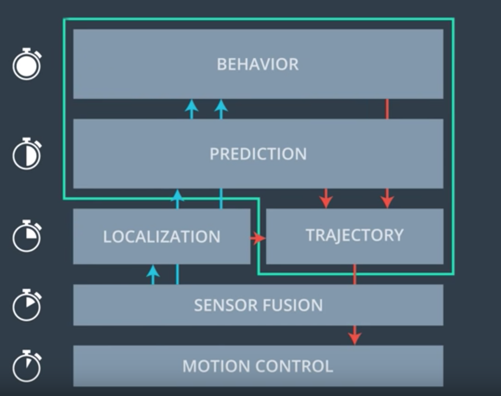
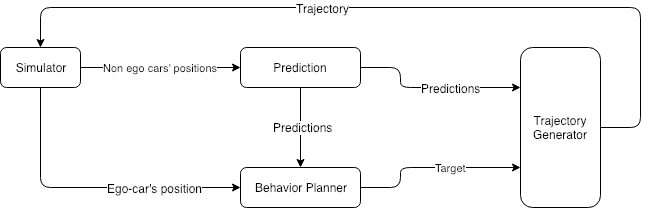
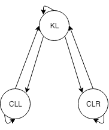

# Path Planning Project writeup

The goal of the project was to develop software for safe driving a car around a virtual highway.
This writeup describes the approach taken to complete the project.

## Design

The design was choosen with respect to the giagram shown in the classroom.

The projects has three main components listed below:
- Prediction
- Behavior Planner
- Trajectory Generator

The Localization, Sensor Fusion and Motion Control components were not implemented as they were already provided as parts of the Term3 simulator.

## Data flow (inputs/outputs)

The developed software runs an infinite loop; at each iteration it takes in the output of the simulator and produces a trajectory for ego-car which is sent back to the simulator.

A highlevel data-flow diagram is presented below:

## Project structure

The `src/` directory of the repository contains the project's source code.
Here you can find descriptions of each file:

| File(s) | Purpose |
|------|---------|
| `main.cpp` | The entrypoint of the project. |
| `utils.h` | Contains helper functions used in different places in the project. |
| `vehicle.h` and `vehicle.cpp` | Describes the vehicle's state such as x, y, s, d coordinates, velocity and yaw. |
| `road.h` and `road.cpp` | Contains a road definition and useful helper methods such as `get_lane_center()`. |
| `spline.h` | Spline interpolation implementation provided in the classroom. |
| `json.hpp` | A module for working with JSONs. |
| `fsm.h` | Defines the Finite State Machine used in the project. |
| `cost.h` | Contains the cost functions used in the behavior module. |
| `prediction.h` and `prediction.cpp` | Implementation of the Prediction module. |
| `behavior.h` and `behavior.cpp` | Implementation of the Behavior module. |
| `traj_gen.h` and `traj_gen.cpp` | Implementation of the Trajectory Generator module. |

## Prediction

For this project I implemented a naive prediction which assumes that all the non-ego cars will move with contant speed along the s-axis.

In order to implement the logic I iterate over a list of non-ego vehicles provided by the simulator. For each vehicle I calculate its velocity as a squared root of the sum of its velocities along the `x-` and `y-` axises: `double velocity = sqrt(vx*vx + vy*vy);`. Then I use the velocity to calculate the distance the car will move along the `s-` axis in time `dt` where `dt` is defined by the `pred_resolution_sec` variable. The `d-` coordinatate of the car does not change over time as we assume that the car moves straight along the `s-` axis.

## Behavior Planner

The behavior planner developed for this project is based on a finite state machine. At each iteration the planner generates rough trajectories for each successor states of the current FMS's state. Then it finds the best trajectory - a trajectory with the minimal cost value. The best trajectory then transforms into a target object.

### FSM and its states

The finite state machine has three states:
- Keep Lane
- Change Lane Left
- Change Lane Right

The transitions between the states are shown on the picture below.

In the **Keep Lane** state the ego-car goes in the middle of its current lane. The car adapts its speed if there is a vehicle ahead of it.

In the **Change Lane Left(Right)** states the ego-car performs a maneuver in order to change its lane on the left(right). In this state the car is also adapts its speed if there is a vehicle ahead of it.

### Rough trajectories

To generate a rough trajectories I implemented a generic function `rough_trajectory`. The function takes in three parameters: current ego-car's state, predictions and target lane. The function will try to generate a rough trajectory from the current car's position to the target lane as far as it can safely go. The algorithms takes into account non-ego vehicles and tries to generate a safe trajectory.

### Cost functions

In order to compare trajectories I defines three cost functions:
- `collision_cost()` - a binary cost function which returns `1` if the given trajectory lead to at least one collision.
- `inefficiency_cost()` - the cost becomes higher if the ego-car moves slower.
- `change_lane_cost()` - adds penalty for a lane change.

The corresponding weights are defined in `behavior.cpp` and choosen as following:
- `w_collision = 100;`
- `w_inefficiency = 10;`
- `w_change_lane = 1;`

I wanted the algorithm to focus on safety that's why any collision is a subject of the highest penalty. I also wanted the algorithm to not drive the car too slow, that why the innefficiency cost function has the second highest weight.

### Target

## Trajectory Generator

### Smoothing

## Further improvements

what can be improved?